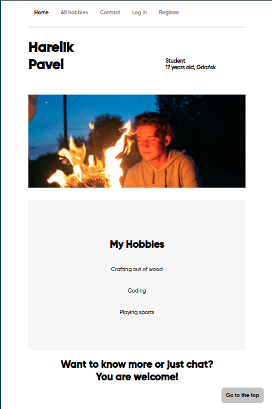
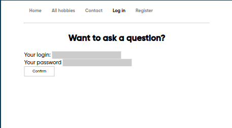
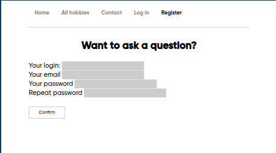

# Study project
## Website about my hobbies

This code is written for project while studying in university. The goal of the project was to write a website that would display information and hobbies. The site was written using PHP language and VirtualBox virtual machine with Apache was used as a server. You can read the configure details in file `materials/instrukcja-konfiguracji-srodowiska.pdf` 

The virtual machine image is available [here](https://drive.google.com/file/d/18KH-GY5uoQnaVtstyYNXWE-sYmfkLOKW/view?usp=sharing)

The application uses the MongoDB database to store data. Also the application is written in MVC architecture. That allows you to easily expand and update the functionality.

The application has account mechanisms (registration, authorization), with which it is possible to upload photos to the site, as well as to configure who they will be available to.

## Instalation

Since the application is designed to run in a virtual machine, you must have VirtualBox installed. The image of the virtual machine with the configured configuration is available in the folder `materials`

Import this virtual machine image into VirtualBox and then create a folder called dev-wai in your file system and copy the contents of the repository there. After select this folder as a shared folder. Now start the VM and if there are no errors anywhere the server will already be running.

the server is listening on two ports on IP 192.168.56.10:
* 80
* 8080

On port 80 the server displays the site from the local `var/www/prod` directory and on port 8080 `var/www/dev` which is mounted on a shared folder with the host system (which you created).

By default, a version of the site as in the repository is available on port 80. On the port you can make changes to the source code and see them immediately. To apply changes on port 8080 to port 80, you need to run the following commands:
```bash
$ rm -r /var/www/prod/*
$ cp –r /var/www/dev/* /var/www/prod/
```

If you have any difficulties or errors you can see a more detailed guide in the file `materials/instrukcja-konfiguracji-srodowiska.pdf` 

## Screenshots







## Some more

> The layout as well as the basic principles became the idea for the realization of the portfolio application. However, it was rewritten in Python using Django framework. The implementation is available [here](https://github.com/greedann/my_portfolio_site)
